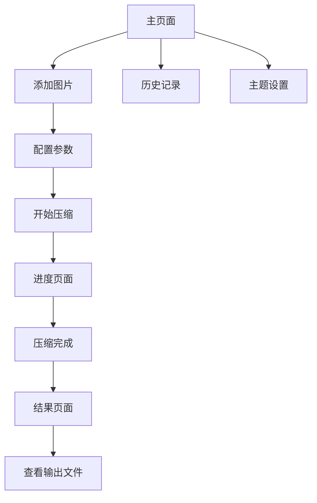

## 1. 产品概述
一款基于 Electron 的跨平台桌面图片压缩应用，帮助用户快速压缩 PNG/JPG 图片文件，节省存储空间。支持拖拽操作、批量处理、实时进度显示，适用于摄影师、设计师、网站开发者等需要优化图片文件大小的用户群体。

## 2. 核心功能

### 2.1 用户角色
本产品为单机桌面应用，无需用户注册登录，所有功能对所有用户开放。

### 2.2 功能模块
图片压缩应用包含以下核心页面：
1. **主页面**：拖拽区域、压缩参数配置、开始压缩按钮
2. **进度页面**：实时压缩进度、文件处理状态、剩余时间显示
3. **结果页面**：压缩结果对比、文件大小统计、输出位置访问

### 2.3 页面详情
| 页面名称 | 模块名称 | 功能描述 |
|---------|---------|---------|
| 主页面 | 拖拽区域 | 支持拖拽单张图片、多张图片或整个文件夹到应用窗口 |
| 主页面 | 参数配置 | 压缩级别选择（低/中/高）、保留元数据开关、输出格式选择、质量滑块调节 |
| 主页面 | 操作按钮 | 开始压缩按钮、清空列表按钮、选择输出目录 |
| 进度页面 | 总体进度 | 显示所有任务的总体完成百分比和进度条 |
| 进度页面 | 文件状态 | 显示当前正在处理的文件名和进度 |
| 进度页面 | 时间预估 | 显示预计剩余完成时间 |
| 结果页面 | 对比展示 | 显示原始文件大小和压缩后文件大小的对比 |
| 结果页面 | 压缩统计 | 显示总压缩率、节省空间大小 |
| 结果页面 | 快捷访问 | 提供打开输出文件夹的快捷按钮 |
| 通用模块 | 历史记录 | 查看之前的压缩任务记录 |
| 通用模块 | 主题切换 | 支持深色/浅色主题切换 |
| 通用模块 | 预览功能 | 压缩前后图片预览对比 |

## 3. 核心流程
用户操作流程：
1. 用户启动应用后进入主页面
2. 通过拖拽或选择方式添加图片文件/文件夹
3. 配置压缩参数（压缩级别、输出格式等）
4. 点击开始压缩按钮
5. 进入进度页面查看实时压缩状态
6. 压缩完成后自动跳转到结果页面
7. 查看压缩结果并访问输出文件

## 4. 用户界面设计

### 4.1 设计风格
- **主色调**：蓝色系（#1890ff）作为主色，灰色系作为辅助色
- **按钮样式**：圆角矩形设计，主要操作为实心按钮，次要操作为线框按钮
- **字体选择**：系统默认字体，标题16px，正文14px，小字12px
- **布局风格**：卡片式布局，顶部导航栏，主要内容区域居中显示
- **图标风格**：使用简洁的线性图标，与DaisyUI组件库保持一致

### 4.2 页面设计概述
| 页面名称 | 模块名称 | UI元素 |
|---------|---------|---------|
| 主页面 | 拖拽区域 | 大卡片设计，虚线边框，中央显示拖拽图标和提示文字，支持拖拽时高亮效果 |
| 主页面 | 参数配置 | 使用DaisyUI的滑块、开关、选择器等组件，分组显示，标签清晰 |
| 进度页面 | 进度展示 | 使用DaisyUI进度条组件，显示百分比数字，配合动画效果 |
| 结果页面 | 对比卡片 | 左右对比卡片设计，显示缩略图、文件大小、压缩率等信息 |
| 通用模块 | 历史列表 | 使用DaisyUI列表组件，显示历史任务的时间、文件数量、压缩率 |

### 4.3 响应式设计
- **桌面优先**：针对桌面端优化，窗口大小可调整
- **最小窗口尺寸**：800x600像素，确保所有功能正常显示
- **拖拽优化**：针对桌面环境的鼠标操作进行优化
- **触摸支持**：同时支持触摸板手势操作

### 4.4 性能要求
- **启动时间**：应用启动时间不超过3秒
- **压缩速度**：单张图片压缩时间不超过5秒（以2MB PNG文件为基准）
- **内存占用**：处理大量图片时内存占用不超过500MB
- **UI响应**：界面操作响应时间不超过100ms