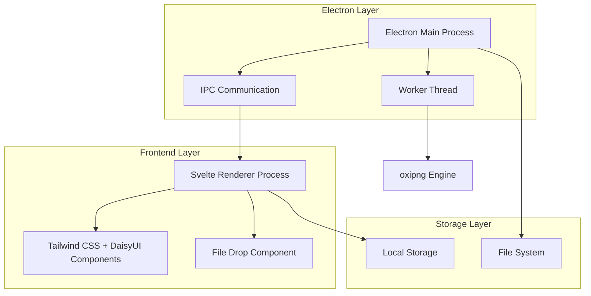
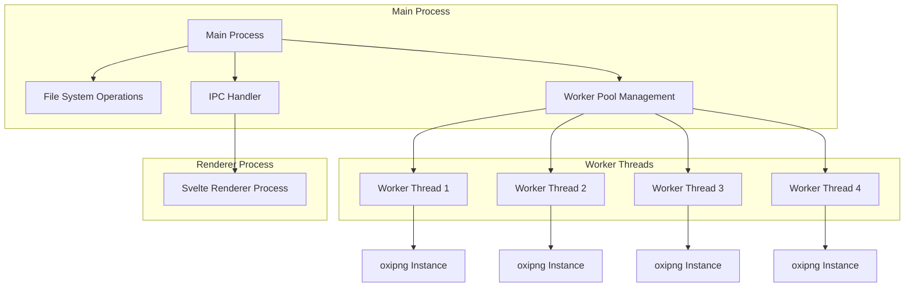

## 1. 架构设计



## 2. 技术描述
- **前端框架**: Svelte@4 + Tailwind CSS@3 + DaisyUI@4 + Vite@5
- **桌面框架**: Electron@28
- **构建工具**: Vite + electron-vite
- **压缩引擎**: oxipng (Rust编写的PNG压缩库)
- **初始化工具**: create-vite (Svelte模板)
- **后端**: 无独立后端，使用Electron主进程处理文件操作

## 3. 路由定义
| 路由 | 用途 |
|-----|-----|
| / | 主页面，图片拖拽和参数配置 |
| /progress | 进度页面，显示压缩进度 |
| /results | 结果页面，展示压缩结果 |
| /history | 历史记录页面 |
| /settings | 设置页面，主题和偏好设置 |

## 4. 核心模块定义

### 4.1 Electron IPC通信
```typescript
// 主进程到渲染进程
interface IPCChannels {
  'compression:start': (files: string[], options: CompressionOptions) => void
  'compression:progress': (progress: CompressionProgress) => void
  'compression:complete': (results: CompressionResult[]) => void
  'compression:error': (error: string) => void
  'file:drop': (files: string[]) => void
  'settings:save': (settings: AppSettings) => void
  'settings:load': () => AppSettings
}
```

### 4.2 压缩选项接口
```typescript
interface CompressionOptions {
  level: 'low' | 'medium' | 'high'  // 压缩级别
  preserveMetadata: boolean            // 保留元数据
  outputFormat: 'png' | 'jpg' | 'webp' // 输出格式
  quality: number                     // 质量设置 1-100
  outputDirectory: string             // 输出目录
  renamePattern?: string              // 重命名模式
}
```

### 4.3 压缩进度接口
```typescript
interface CompressionProgress {
  totalFiles: number      // 总文件数
  completedFiles: number  // 已完成文件数
  currentFile: string     // 当前处理文件名
  percentage: number      // 总体进度百分比
  estimatedTime: number  // 预估剩余时间(秒)
}
```

### 4.4 压缩结果接口
```typescript
interface CompressionResult {
  originalPath: string    // 原始文件路径
  outputPath: string      // 输出文件路径
  originalSize: number    // 原始文件大小(字节)
  compressedSize: number  // 压缩后大小(字节)
  compressionRatio: number // 压缩率
  status: 'success' | 'error' // 处理状态
  errorMessage?: string   // 错误信息
}
```

## 5. 进程架构设计



## 6. 数据模型

### 6.1 历史记录数据模型
```typescript
interface CompressionHistory {
  id: string                    // 唯一标识
  timestamp: number              // 时间戳
  files: Array<{
    name: string                // 文件名
    originalSize: number         // 原始大小
    compressedSize: number      // 压缩后大小
  }>
  totalOriginalSize: number     // 总原始大小
  totalCompressedSize: number   // 总压缩后大小
  averageCompressionRatio: number // 平均压缩率
  outputDirectory: string       // 输出目录
}
```

### 6.2 应用设置数据模型
```typescript
interface AppSettings {
  theme: 'light' | 'dark'       // 主题设置
  defaultOutputDirectory: string // 默认输出目录
  compressionLevel: 'low' | 'medium' | 'high' // 默认压缩级别
  preserveMetadata: boolean      // 默认保留元数据
  maxWorkerThreads: number       // 最大工作线程数
  enableNotifications: boolean   // 启用通知
}
```

## 7. 关键技术实现

### 7.1 Worker线程池管理
- 使用Node.js Worker Threads创建线程池
- 默认创建4个工作线程，可根据CPU核心数调整
- 实现任务队列，确保线程负载均衡
- 支持动态调整线程数量

### 7.2 文件拖放处理
- 使用Electron的drag-and-drop API
- 在渲染进程实现拖拽区域组件
- 通过IPC将文件列表传递给主进程
- 支持文件夹递归扫描

### 7.3 内存管理优化
- 使用流式处理大文件
- 及时清理不再使用的图片数据
- Worker线程池复用，避免频繁创建销毁
- 实现内存监控和告警机制

### 7.4 错误处理机制
- 文件格式验证（支持PNG、JPG、JPEG、WEBP）
- 损坏文件检测和处理
- 磁盘空间检查
- 权限错误处理
- 用户友好的错误提示

## 8. Svelte状态管理

### 8.1 Svelte Stores定义
```typescript
// 压缩任务状态管理
import { writable, derived } from 'svelte/store';

// 当前压缩任务状态
export const compressionStore = writable({
  isRunning: false,
  totalFiles: 0,
  completedFiles: 0,
  currentFile: '',
  progress: 0,
  estimatedTime: 0
});

// 文件列表管理
export const fileStore = writable([]);

// 压缩结果管理
export const resultStore = writable([]);

// 应用设置管理
export const settingsStore = writable({
  theme: 'light',
  compressionLevel: 'medium',
  preserveMetadata: false,
  outputDirectory: ''
});

// 派生状态：计算压缩统计
export const compressionStats = derived(resultStore, $results => {
  const totalOriginal = $results.reduce((sum, r) => sum + r.originalSize, 0);
  const totalCompressed = $results.reduce((sum, r) => sum + r.compressedSize, 0);
  return {
    totalFiles: $results.length,
    totalOriginal,
    totalCompressed,
    compressionRatio: totalOriginal > 0 ? ((totalOriginal - totalCompressed) / totalOriginal * 100).toFixed(1) : 0
  };
});
```

### 8.2 组件状态同步
```typescript
// 在Svelte组件中使用store
import { compressionStore, fileStore } from './stores/compression.js';

// 文件拖拽处理
function handleDrop(e) {
  const files = Array.from(e.dataTransfer.files);
  fileStore.update(current => [...current, ...files]);
}

// 压缩进度监听
compressionStore.subscribe(state => {
  if (state.isRunning) {
    // 更新UI显示
  }
});
```

## 10. 性能优化策略
- 使用多线程并行处理多个文件
- 实现图片预处理（尺寸检测、格式验证）
- 压缩结果缓存，避免重复压缩
- 增量更新UI，减少重渲染
- 使用虚拟列表展示大量文件